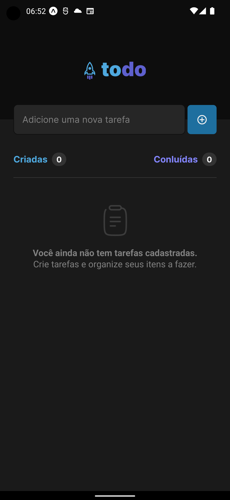
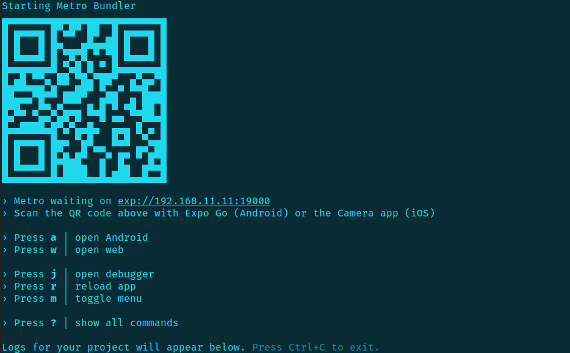

<h1 align="center">
   <span style="color: #4EA8DE">to</span><span style="color: #5E60CE">do</span>
</h1>

<p align="center">


</p>

---

<p align="center">
  <a href="#-projeto">Projeto</a>&nbsp;&nbsp;&nbsp;|&nbsp;&nbsp;&nbsp;
  <a href="#-como-rodar-o-projeto">Como rodar o projeto</a>&nbsp;&nbsp;&nbsp;|&nbsp;&nbsp;&nbsp;
  <a href="#-tecnologias">Tecnologias</a>&nbsp;&nbsp;&nbsp;|&nbsp;&nbsp;&nbsp;
  <a href="#-layout">Layout</a>&nbsp;&nbsp;&nbsp;|&nbsp;&nbsp;&nbsp;
  <a href="#-licença">Licença</a>
</p>

## 💻 Projeto

O **todo** é um aplicativo de gerenciamento de tarefas minimalista e eficiente, projetado para ajudá-lo a manter uma lista clara e organizada de suas tarefas diárias.

Ao abrir o aplicativo, você é recebido com uma tela simples, com um input de texto e um botão para adicionar uma nova tarefa à sua lista. Depois de adicionar uma tarefa, ela aparece imediatamente na lista, que fica logo abaixo do input.

Você pode facilmente editar sua lista de tarefas. Para remover uma tarefa, basta clicar na lixeira ao lado da tarefa correspondente. Se você concluiu uma tarefa, basta clicar na caixa de seleção correspondente para marcá-la como concluída.

O aplicativo **todo** é intuitivo e fácil de usar, permitindo que você se concentre nas suas tarefas sem distrações desnecessárias. Além disso, o aplicativo possui contadores de tarefas totais e concluídas para ajudá-lo a monitorar seu progresso ao longo do tempo.

Em resumo, o **todo** é um aplicativo simples, mas poderoso, que pode ajudá-lo a manter suas tarefas organizadas e garantir que você nunca perca nada importante.

### 📱 Telas do aplicativo

**Lista de Tarefas**




## 🧭 Como rodar o projeto

### 🚨 Requisitos

**Instalação aplicativo do Expo no smartphone**

- [Expo Android](https://play.google.com/store/apps/details?id=host.exp.exponent&hl=pt_BR&gl=US) ou [Expo iOS](https://apps.apple.com/us/app/expo-go/id982107779)

**Clone este repositório**

```bash
git clone git@github.com:vitorsemidio-dev/rn-todo-list.git
```

**Acesse a pasta**

```bash
cd rn-todo-list
```

**Instale as dependências e inicie o projeto**

```bash
npm install
```

```bash
npx expo start
```

**Abra o projeto no dispositivo**

Abra o aplicativo do Expo no smartphone, aponte a câmera para o QRCode que apareceu no terminal após executar o comando `npx expo start`.

**Importante**: _O dispositivo móvel e o computador precisam estar na mesma rede_



## 🚀 Tecnologias

Esse projeto foi desenvolvido com as seguintes tecnologias:

- [Expo](https://expo.dev/)
- [React Native](https://reactnative.dev/)
- [Styled Components](https://styled-components.com/)
- [TypeScript](https://www.typescriptlang.org/pt/)

## 🔖 Layout

Você pode visualizar o layout do projeto através [deste link](https://www.figma.com/file/1XfZQGSWk4HWjvwcjd2nOP/ToDo-List).

<a href="https://www.figma.com/file/1XfZQGSWk4HWjvwcjd2nOP/ToDo-List">
  
</a>

## 📝 Licença

Esse projeto está sob a licença MIT. Veja o arquivo [LICENSE](LICENSE) para mais detalhes.
